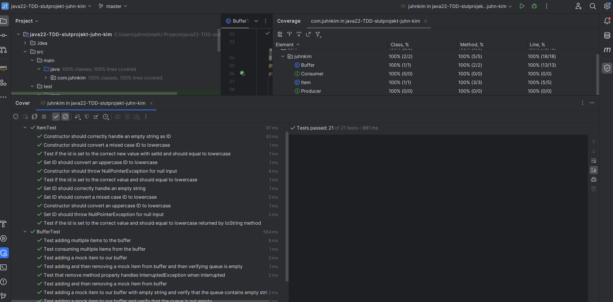

# java22-TDD-slutprojekt-juhn-kim

# Overview
This project we are testing code according to the TDD-principles. The program is similar to our final project in advanced Java where 
we created a "producer consumer" program. A producer produces an "item" object and the "item" gets placed in the buffer.
A consumer consumes the "item" from the buffer.

# Key Features
* Construction Behavior
* Prime Number Identification
* Exception Handling

## The tests covers the following features of the 'Buffer' class:
### Constructor Tests
There aren't specific constructor tests for the Buffer class as it mainly involves initializing a
Queue<Item> without specific parameters. However, the effective functioning of the constructor is
implicitly tested through the behavior of the add and remove methods.

### Getters Tests
Getters for the Buffer class are not explicitly mentioned,
but the state of the buffer is indirectly checked in various tests (e.g., ensuring the buffer is empty
or not after certain operations). 

## The tests covers the following features of the 'Item' class:

### Constructor Tests
Handling Different Input Cases: Ensures the constructor correctly handles various input strings, including null, empty string, upper case, and mixed case, converting them to lowercase as required.
Getters Tests

**ID Retrieval:** Tests that the getId() method returns the correct, lowercased ID of the item.
**Important Tests**
**Set ID:** Verifies that the setId() method updates the item's ID correctly and converts it to lowercase.
**Null Handling:** Confirms that the class throws NullPointerException when null is used for the ID, both in the constructor and the setId() method.
**Empty String Handling:** Tests how the class handles an empty string as an ID.

### Important Tests
**Adding Items:** Tests ensure that items can be successfully added to the buffer.
**Removing Items:** Tests verify that items can be removed correctly, following the expected behavior.
**Handling Empty Buffer:** Tests confirm that the remove() method behaves as expected when the buffer is empty, including waiting behavior and exception handling.
**Thread Safety:** Multi-threaded tests check the thread safety and synchronization aspects of the buffer, particularly important in a producer-consumer context.

# Reflection and Conclusion

# Test case
